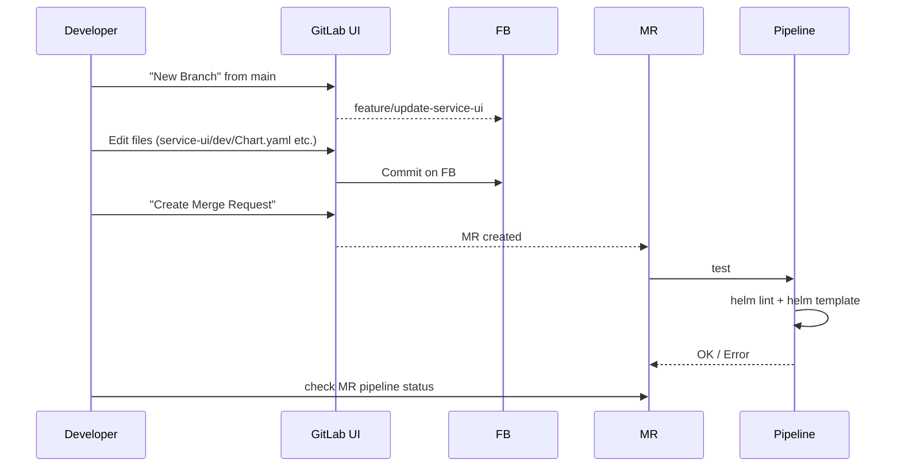
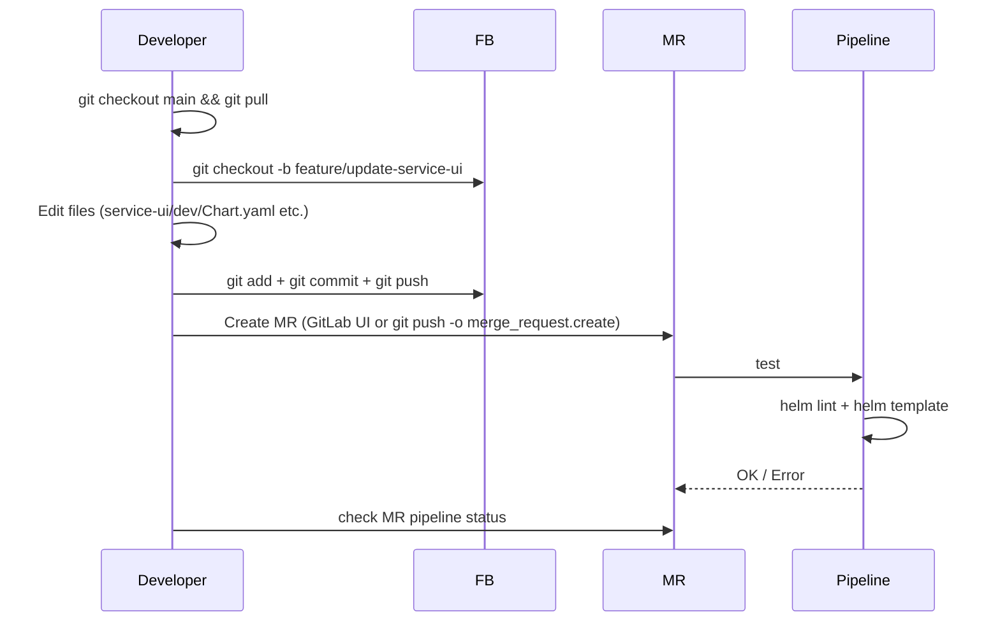

# Pipeline Foundations: Overview and Workflow

This page covers the CI/CD context, pipeline overview, and development workflow for Helm chart changes.

Back to [Pipeline: Foundations](../foundations.md).

## Context

This document describes the development workflow for Helm charts.
The primary target is ArgoCD, but private Demo customers should also
be able to use the charts without ArgoCD. The long-term goal is to
replace the existing Demo umbrella chart. Existing charts that are
currently managed in separate repositories can later be integrated
into this repository once the umbrella chart is retired. This is not
a priority at the moment.

## Overview

CI/CD pipelines for Helm chart management in `charts-repository/`:

| Pipeline  | Purpose                                                               |
| --------- | --------------------------------------------------------------------- |
| `test`    | Validate charts (lint, template, unit tests)                          |
| `release` | Detect changed charts, create versions, create Git tags               |
| `promote` | Promote charts from dev → stage or stage → prod (via MR)              |
| `publish` | Build charts and upload to Harbor (triggered by `build-<date><time>`) |
| `sprint`  | Bump major version of all root apps at sprint start                   |
| `upgrade` | Update service version in dev/ (triggered by service deploy pipeline) |
| `sync`    | Copy configurations of all known clusters into the current repository |
| `update`  | Refresh unit test data                                                |

### When Does Each Pipeline Run?

|                             | `test` | `release` | `promote` | `publish` | `sprint` | `upgrade` | `sync` | `update` |
| --------------------------- | :----: | :-------: | :-------: | :-------: | :------: | :------: | :----: | :------: |
| **FB** (MR created/updated) |   x    |           |           |           |          |          |        |    x     |
| **main** (Merge)            |        |     x     |     x     |           |          |          |        |          |
| **Git Tag**                 |   x    |           |           |     x     |          |          |        |          |
| **Timer**                   |        |           |           |           |          |          |   x    |    x     |
| **Timer** (Mon 08:00)       |        |           |           |           |    x     |          |        |          |
| **Service Deploy Pipeline** |        |           |           |           |          |    x     |        |          |

Each pipeline autonomously decides whether there is work to do.

`test` aborts the running pipeline if quality checks are not met.
`release` creates app tags (documentation only) and exactly one build tag.
Only `build-<date><time>` triggers `publish`.
`publish` runs only when `test` was successful.
`sprint` runs every Monday at 08:00, checks if a sprint change is due, and bumps major versions if so.
`upgrade` is triggered by the existing service deploy pipelines.
`sync` copies data from all external cluster repositories into the current repository and starts `update`.
`update` renders all clusters and stores the resulting manifests as unit test data. This makes changes directly visible in the MR.

### `hydra ci run auto` (CLI orchestration)

The `hydra ci run auto` subcommand runs multiple pipeline stages in a single invocation, in a fixed default order aligned with chart lifecycle dependencies: `test` → `release` → `publish` → `promote` → `sync` → `update` → `sprint` → `upgrade`. The list can be overridden per repository with optional `ci.autoSteps` in `.hydra-ci.yaml` (same file as all other CI settings). Each stage uses the same implementation as the matching standalone `hydra ci run <stage>` command.

Hydra resolves the charts Git repository from `ci.rootAppsPath`, opens that repository, and logs the current branch name (or `HEAD` in detached state). Change detection inside each stage still uses the repository’s `HEAD` as today.

Execution is **fail-fast**: on the first stage error, including “not yet implemented” stubs, `auto` stops and does not run later stages.

## Development Workflow

### 1. Create Feature Branch

A developer creates a new feature branch from `main`, modifies one or
more `dev/` directories, and opens an MR. This automatically starts
the `test` pipeline. Changes to `stage/` or `prod/` directories are
also supported, even though this is not the standard workflow.

#### Variant A: Via GitLab UI



#### Variant B: Local



In both variants, `test` and `update` start automatically once the MR exists.
Every subsequent push to the feature branch triggers both pipelines again.

#### 2. Test Feature Branch

All feature branches should be tested:

- A local ArgoCD installation can be created
- An ArgoCD installation on vSphere can be created
- In an existing ArgoCD installation by pointing the respective app to this branch
- In an existing ArgoCD, auto-sync can be disabled, then Helm charts can be deployed manually to the cluster:
  - via `helm template | kubectl apply` (or `hydra gitops apply <app>`)
  - via `helm diff` to check for changes (or `hydra gitops diff <app>`)
  - the output of `helm template` (or `hydra local template <app>`) can be redirected to a file; after a change, repeat with a second file, then diff for differences
- Unit tests can verify what changes would be caused in customer clusters — developers can run the `update` pipeline locally for this

#### 3. Modify Feature Branch

The developer modifies one or more `dev/` directories
(e.g. new dependency version, changed values, new templates).

```text
Branch: feature/update-service-ui
Changed: charts-repository/apps/demo/service-ui/dev/Chart.yaml
         charts-repository/apps/demo/service-auth/dev/Chart.yaml
```

Every push triggers `test` and `update` again. This ensures that all changes
to all clusters are visible in each MR. Both pipelines can also be executed
locally by developers without committing.

#### 4. Test Pipeline in Feature Branch

The `test` pipeline only checks changed charts:

| Step            | Description                                                                                        |
| --------------- | -------------------------------------------------------------------------------------------------- |
| Detect changes  | Build-tag based: which `*/dev/`, `*/stage/`, `*/prod/` changed since last build tag for that path? |
| `helm lint`     | Syntax check for changed charts                                                                    |
| `helm template` | Test rendering to catch template errors                                                            |

Result is reported as MR status (OK/Error).
The MR can only be merged once `test` passes.

#### 5. Update Pipeline in Feature Branch

The `update` pipeline renders all charts against all cluster definitions
and commits any resulting changes.

To prevent infinite loops, the following governance applies:

1. The pipeline may produce at most **one** auto-commit per MR
2. Auto-commits only for unit test data (no `Chart.yaml`/`values.yaml` rewrite)
3. The auto-commit uses a fixed commit pattern, e.g. `update: refresh unit test data [auto]`
4. If a diff is detected on the next run, `update` fails and requires manual review/commit

Result is reported as MR status (OK/Error).
The MR can only be merged once `update` passes, ensuring that there are
no uncommitted changes and all cluster impacts are visible during review.

#### 6. Review and Merge

After successful `test`, `update`, and code review, the MR can be merged to `main`.

#### 7. Pipelines for the main Branch

Each merge to `main` starts multiple pipelines, but no upload to Harbor
is performed. Each pipeline autonomously checks whether there is work to do:

The `release` pipeline automatically updates the version numbers of all
changed charts, creates their **root apps** with the new child versions,
and publishes them together. A Git commit is created containing all changes.
Various Git tags are created for traceability.
App tags are purely for documentation; the `publish` trigger is exclusively
the `build-<date><time>` tag.
Only one release pipeline runs; it builds and publishes child apps first,
then root apps.

The `promote` pipeline creates **one MR per chart** and sends an
**MS Teams notification** to the responsible team.

The promote dev→stage pipeline deletes the `stage` directory and copies
`dev` to `stage`. If differences are found, a branch and a matching MR
are created. The same applies from `stage` to `prod`.

If a `dev/` directory exists but the corresponding `stage/` (or `prod/`)
directory does not yet exist, the promote pipeline still creates the
branch and MR (or just the branch in `--local` mode) with the copy to
the target environment. This supports newly created apps.

#### 8. Promote MR dev→stage Is Merged

After test/review, the team merges the promote MR. This updates `stage/`
→ another merge to `main` → pipelines run again and trigger `promote`
from `stage` to `prod`.

#### 9. Promote MR stage→prod Is Merged

Same principle: `prod/` is updated → main pipelines run.

**Result:** The change has now reached all three environments.

---
