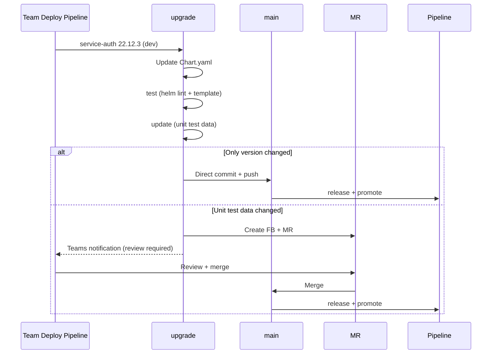

# Pipeline: Sprint and Upload

This file explains the sprint-start version bump flow and the upgrade-triggered chart update flow.

Back to [Pipeline detail index](../pipeline.md).

## Pipeline: `sprint`

### Purpose

Bumps the major version of all root apps at sprint start. This ensures
each sprint has its own version number and changes can be clearly
attributed to a sprint.

### Trigger

Runs automatically every Monday at 08:00 (timer/cron schedule).
The pipeline autonomously checks whether it is a sprint week
(e.g. based on the sprint calendar or a configurable sprint length).
If no sprint change is due, the pipeline exits immediately.

### Versioning

| Environment | Gets Sprint Number     | Example (Sprint 42, previous Sprint 41) |
| ----------- | ---------------------- | --------------------------------------- |
| dev         | current sprint number  | `42.0.0-dev`                            |
| stage       | current sprint number  | `42.0.0-stage`                          |
| prod        | previous sprint number | `41.0.0`                                |

### Steps

1. **Check sprint change:** Is today the start of a new sprint?
   - Yes → continue with step 2
   - No → pipeline exits immediately
2. **Determine sprint numbers:** Identify current and previous sprint number
3. **For each root app (demo, cluster-infra, demo-infra, cicd, argocd):**
   - `dev/Chart.yaml`: version → `42.0.0-dev`
   - `stage/Chart.yaml`: version → `42.0.0-stage`
   - `prod/Chart.yaml`: version → `41.0.0` (previous sprint)
4. **Commit + push to main**
5. Regular pipeline flow: `release` + `promote` run automatically

### Example

```text
Sprint 42 starts, previous sprint was 41:

  apps/demo/root/dev/Chart.yaml        → version: 42.0.0-dev
  apps/demo/root/stage/Chart.yaml      → version: 42.0.0-stage
  apps/demo/root/prod/Chart.yaml       → version: 41.0.0
  apps/cluster-infra/root/dev/Chart.yaml   → version: 42.0.0-dev
  apps/cluster-infra/root/stage/Chart.yaml → version: 42.0.0-stage
  apps/cluster-infra/root/prod/Chart.yaml  → version: 41.0.0
  ...
```text

Within a sprint, minor/patch versions increase automatically through
`release` (e.g. `42.0.0-dev` → `42.1.0-dev` → `42.1.1-dev`).

---

## Pipeline: `upgrade`

### Purpose

Updates the service version in `dev/Chart.yaml` when a team deploys a
new service version. This pipeline is triggered by the existing service
deploy pipelines (same pipelines as before, with this repository
additionally being updated).

### Background

Currently only Flux is updated during deployment. In the future, this
repository will also be updated simultaneously so that the chart versions
in `charts-repository` always reflect the current state.

### Trigger

Triggered by the existing service deploy pipeline, e.g.:

- Team deploys `service-auth` version `22.12.3` to dev
- The service deployment pipeline triggers `upgrade` in this repository

### Steps

1. **Receive service + version:** e.g. `service-auth`, `22.12.3`, `dev`
2. **Update Chart.yaml:**
   `charts-repository/apps/demo/service-auth/dev/Chart.yaml`
   → `dependencies[0].version = "22.12.3"`
3. **Run test:** `helm lint` + `helm template` to ensure the chart
   still renders correctly
4. **Run update:** Refresh unit test data.
   This makes service chart changes (e.g. new template parameters)
   visible in the version bump commit for all clusters
5. **Decision: Direct push or MR**

### Direct Push vs. MR

| Change                      | Action                                   |
| --------------------------- | ---------------------------------------- |
| Only version number changes | Push directly to `main`                  |
| Unit test data also changes | Create FB + MR + send Teams notification |

#### Only Version Number

```text
upgrade detects: only dependencies[0].version changed
→ Commit directly to main: "upgrade: service-auth 22.12.3 (dev)"
→ Regular pipeline flow (release, promote)
```

#### Unit Test Data Changes

When rendered manifests also change due to the version bump
(e.g. new environment variables, changed labels, new container ports),
a review is needed:

```text
upgrade detects: unit test data has changed
→ Create FB: upgrade/service-auth-22.12.3
→ Create MR: "upgrade: service-auth 22.12.3 (dev) - Review required"
→ Teams notification: "service-auth 22.12.3 has chart changes, please review"
→ Link to MR
```text

### Example



---
