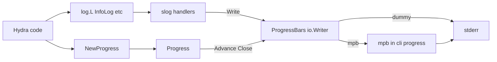

# Log and terminal progress

This document describes how structured logging (`base/log`) coordinates with **terminal progress bars**: the **mpb**-backed implementation lives in the **`cli/progress`** package only; two interfaces, a single `NewProgress` entry point on the logger, and stderr as the final sink.

## Interfaces (`base/log`)

| Interface | Role |
| --------- | ---- |
| **`ProgressBars`** | Container for footer output: implements **`io.Writer`** for the slog handler chain (for mpb: `(*mpb.Progress).Write`). Owns **multiple** bars, ordered **top to bottom**. Implementations: **dummy** (in `base/log`) and **mpb** (only in **`cli/progress`**). |
| **`Progress`** | A **single** progress bar handle. **Start** is implied by **`Logger.NewProgress(...)`**, **end** by **`Progress.Close()`** (no parameters). Between them, only **`Advance`**. Each **`NewProgress`** creates a **new** bar; **several bars may be active at once** (each has its own **`Progress`**). |

## Mapping from the previous footer API

| Previous (`ResourceFooterProgress`) | New |
| ----------------------------------- | --- |
| `StartPhase(operation, total)` | Parameters of **`NewProgress(operation, total)`** (or an options struct, e.g. for unknown totals / discovery) |
| `Advance(index, total, detail)` | **`Progress.Advance(...)`** |
| `EndPhase(resultSummary)` | **`Progress.Close()`** to remove the bar; if **`resultSummary`** is non-empty, log it **after** `Close` with normal **`InfoLog`** / slog (not a `Close` argument) |
| Footer / container shutdown (mpb `Wait`, etc.) | **`ProgressBars.Close()`** at end of CLI run — distinct from **`Progress.Close`** per bar |

## Two different `Close` operations

| Call | Scope | Behavior |
| ---- | ----- | -------- |
| **`Progress.Close()`** | One bar | Removes **that** bar immediately (visual part of the old **`EndPhase`**). **No parameters.** Safe to call while other bars from other **`NewProgress`** calls are still active. |
| **`ProgressBars.Close()`** | Whole footer container | Tears down the **entire** progress UI for the process step. In the mpb implementation this includes **`(*mpb.Progress).Wait()`** — see below. Not the same as closing a single bar. |

## What `Wait()` is for (mpb)

In **mpb**, **`(*mpb.Progress).Wait()`** shuts down the **progress container**: it blocks until work on that container is finished and internal goroutines stop. Hydra should call it **once** per CLI run, inside **`ProgressBars.Close()`** for the mpb-backed implementation (for example via `defer` when the cluster command ends).

**After `Wait()`:** that mpb container must not be written to again; further **`Write`** calls return **`DoneError`**. The logging layer must then target plain **stderr** or only run in a **new** process.

**`Wait()` is not** “wait until one bar finishes” — that is **`Progress.Close`** for that bar. **`Wait()`** is “shut down the **whole** mpb `Progress` instance.”

## Logger surface

- The **`Logger`** exposes **only `NewProgress(...)`** for progress — no extra progress helpers on the logger.
- **`log.Configure`** binds a **`ProgressBars`** instance as the **slog output** (`io.Writer`), so normal **`InfoLog` / `ErrorLog`** lines use the same writer as mpb’s “lines above the bar” behavior.

## Module boundaries

- **`base/log`**: defines **`ProgressBars`** and **`Progress`**, dummy **`ProgressBars`**, **no** import of mpb.
- **`cli/progress`**: the only mpb-backed **`ProgressBars`** implementation; configures bar **priority / order** for top-down display. Wired from `cli/cmd` (e.g. `configureLogging`) and cluster actions.
- **`core/k8s`**: call sites use **`log.Progress`** (or the final exported name) **directly** in function parameters — **no type alias** of the old name to the new type; remove or replace **`ResourceFooterProgress`** by updating signatures and call sites explicitly.

## CLI flags

- Global **`--no-progress`**: forces the **dummy** `ProgressBars` (no mpb), with step-style detail available at debug level where applicable.

## Data flow

## Risks and lifecycle

- **`Progress.Close`:** removes **one** bar as soon as it is called.
- **`NewProgress`:** always allocates **another** bar; **overlapping** bars are **allowed** and should be supported by the implementation.
- Keep **`Progress.Close`** (per bar) and **`ProgressBars.Close`** (container, **`Wait()`** in mpb) **strictly separate** in code and docs.
- After **`ProgressBars.Close`** / **`Wait()`**, **`Write`** on that container may return **`DoneError`** — re-point logging or stderr as documented above.

## Related

- CLI wiring: [`cli.md`](cli.md), [`details/cli.md`](details/cli.md) (logging configuration).
- User-facing behavior: manual pages for cluster commands and global flags (`--no-progress`, `--json-log`).
