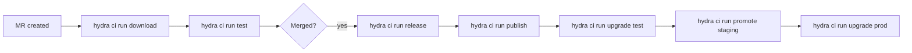

# Workflow: CI Pipeline

How Hydra integrates with CI/CD automation.

## Overview

Hydra's CI commands run in GitLab CI pipelines and automate:
- Dependency downloads for merge requests (`hydra ci run download`)
- Validation on merge requests (`hydra ci run test`)
- Release creation (`hydra ci run release`)
- Promotion across stages (`hydra ci run promote`)
- Chart publishing (`hydra ci run publish`)
- Automated upgrades (`hydra ci run upgrade`)

## Pipeline Stages

```text
MR Created → ci download → ci test → (merge) → ci release → ci publish → ci upgrade (test) → ci promote (staging) → ci upgrade (prod)
```

## Workflow Diagram



## Stage Responsibilities

- `hydra ci run download`: Refresh dependencies for changed charts locally, even when `charts/` already contains artifacts.
- `hydra ci run test`: Validate changed charts offline against already-downloaded dependencies. Fails when a dependency is missing.
- `hydra ci run publish`: Download dependencies again as part of publishing, package and sign the chart, then optionally push the chart plus provenance signature. With `--skip-signing`, Hydra publishes unsigned charts and logs a warning.

## Configuration

CI behavior is governed by `.hydra-ci.yaml` in the repository root:

```yaml
clusters:
  test:
    auto-deploy: true
  prod:
    auto-deploy: false
    require-approval: true
```

## Affected App Detection

`hydra ci run auto` determines which apps are affected by a change by analyzing:
- Modified files in the merge request
- Dependency graph (apps that transitively depend on changed apps)

Only affected apps are tested/deployed.

## See Also

- [Configuration: .hydra-ci.yaml](../configuration/hydra-ci-yaml.md)
- [Commands: CI](../commands/ci/)
- [hydra ci run test](../commands/ci/test.md)
